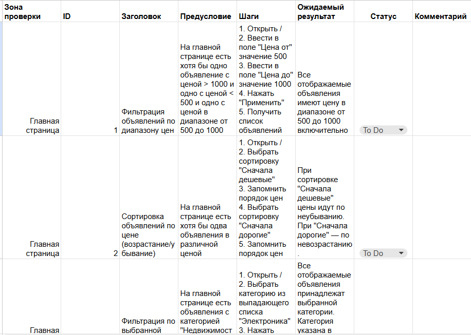
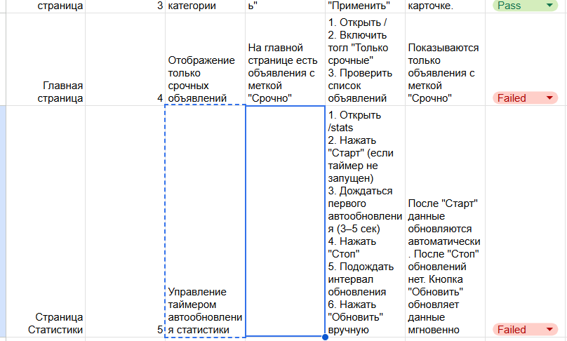
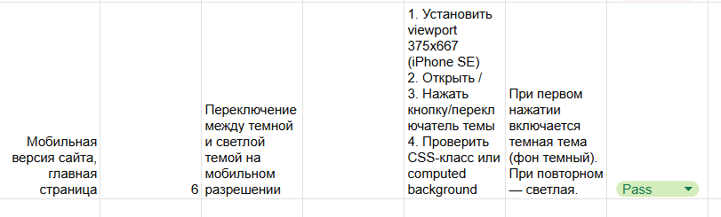

=======
# QA-AvitoTask-spring2026


##### Задание №1: Поиск bag'ов на скриншоте
 Со всей информацией можно ознакомиться в Task1.md в корне репозитория

##### Задание №2: UI-тесты


##### Отчет

### Тест-кейсы написаны в google-таблице: https://docs.google.com/spreadsheets/d/1vAlFSbtkZkQY88fN94tMmLuOOaUPIatikfGtHHa48-I/edit?usp=sharing



### Пройденные тесты: Сортировка объявлений по цене (возрастание/убывание), Фильтрация по выбранной категории, Переключение между темной и светлой темой на мобильном разрешении.

### Проваленные тесты: Фильтрация объявлений по диапазону цен, Отображение только срочных объявлений, Управление таймером автообновления статистики.

### Требования

- Для успешного входа на сайт может потребоваться подключенный vpn-сервис, поэтому перед запуском теста проверьте корректность открытия сайта https://cerulean-praline-8e5aa6.netlify.app/ в Chrome
- Node.js 18+ (лучше LTS)
- npm 9+

### Установка

1) Установить зависимости:

```bash
npm install
```
Удостовериться, что установились браузеры
```bash
npx playwright install
```

### Запуск тестов

Запустить все тесты:

```bash
npx playwright test
```

Запустить конкретный тест по названию:
```bash
npx playwright test -g "Фильтрация объявлений по диапазону цен"

npx playwright test -g "Сортировка объявлений по цене (возрастание/убывание)"

npx playwright test -g "Фильтрация по выбранной категории"

npx playwright test -g "Управление таймером автообновления статистики"

npx playwright test -g "Переключение между темной и светлой темой на мобильном разрешении"

```

