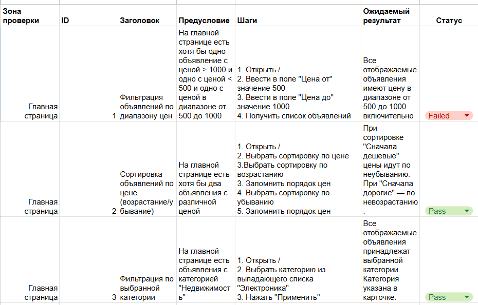
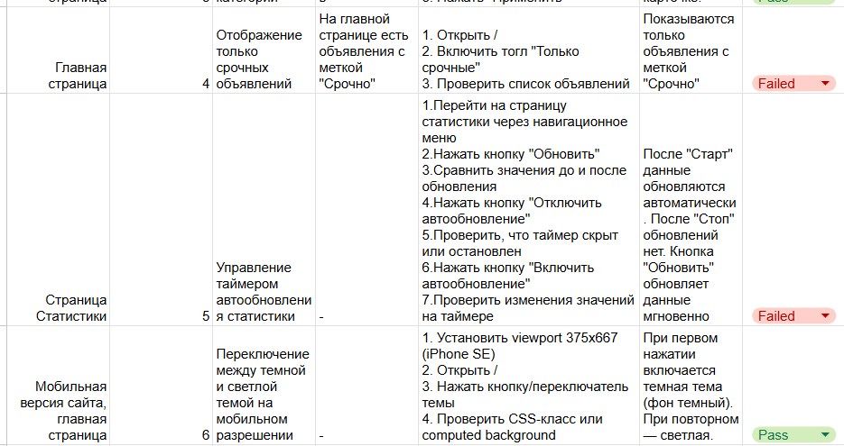

##### Отчет

### Тест-кейсы написаны в google-таблице: https://docs.google.com/spreadsheets/d/1vAlFSbtkZkQY88fN94tMmLuOOaUPIatikfGtHHa48-I/edit?usp=sharing

### Пройденные тесты: Сортировка объявлений по цене (возрастание/убывание), Фильтрация по выбранной категории, Переключение между темной и светлой темой на мобильном разрешении.

### Проваленные тесты: Фильтрация объявлений по диапазону цен, Отображение только срочных объявлений, Управление таймером автообновления статистики.

### Баг-репорты находятся в файле: [BUGS.md](https://github.com/Alyona-super/QA-AvitoTask-spring2026/blob/main/BUGS.md)
